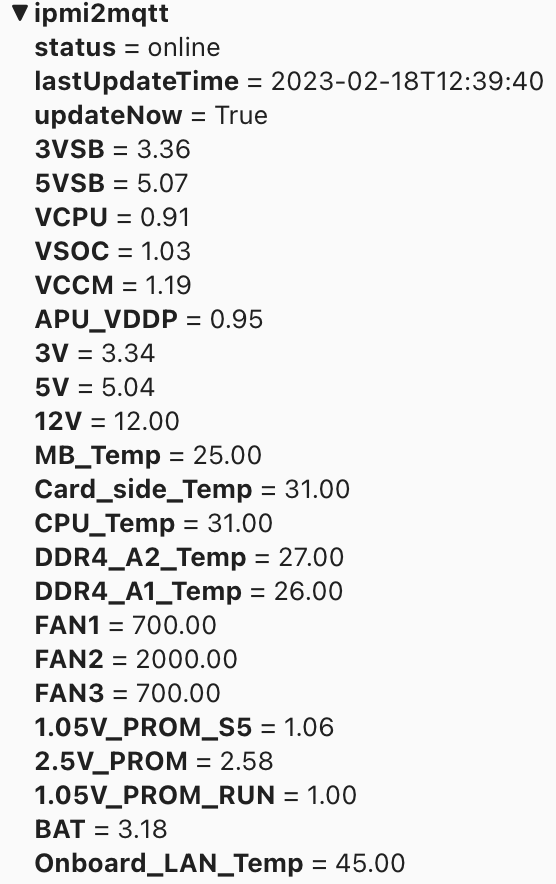

# ipmi2mqtt

Simple IPMI client to monitor server and forward values to MQTT broker.

MQTT explorer screenshot:



Available IPMI variables can vary per server.

App supports only one IPMI server at the time.
Run multiple docker container instances if information need to be fetched from multiple IPMI servers.

## Environament variables

See common environment variables from [MQTT-Framework](https://github.com/paulianttila/MQTT-Framework).

| **Variable**               | **Default** | **Descrition**                                                                                                |
|----------------------------|-------------|---------------------------------------------------------------------------------------------------------------|
| CFG_APP_NAME               | ipmi2mqtt   | Name of the app.                                                                                              |
| CFG_IPMI_HOST              | 127.0.0.1   | IPMI server to connect.                                                                                       |
| CFG_IPMI_USER              | None        | Username for IPMI server.                                                                                     |
| CFG_IPMI_PASS              | None        | Password for IPMI server.                                                                                     |
| CFG_TIMEOUT                | 30          | Timeout to IPMI server connection.                                                                            |
| CFG_CACHE_TIME             | 300         | Cache time in seconds for IPMI values. During cache time, values are only updeted to MQTT if value changed.   |

## Example docker-compose.yaml

```yaml
version: "3.5"

services:
  ipmi2mqtt:
    container_name: ipmi2mqtt
    image: paulianttila/ipmi2mqtt:2.0.0
    restart: unless-stopped
    environment:
      - CFG_LOG_LEVEL=DEBUG
      - CFG_MQTT_BROKER_URL=127.0.0.1
      - CFG_MQTT_BROKER_PORT=1883
      - CFG_IPMI_HOST=192.168.10.2
      - CFG_IPMI_USER=<username>
      - CFG_IPMI_PASS=<password>
      - CFG_CACHE_TIME=300
    healthcheck:
      test: ["CMD", "curl", "-f", "http://localhost:5000/healthy"]
      interval: 60s
      timeout: 3s
      start_period: 5s
      retries: 3
 ```